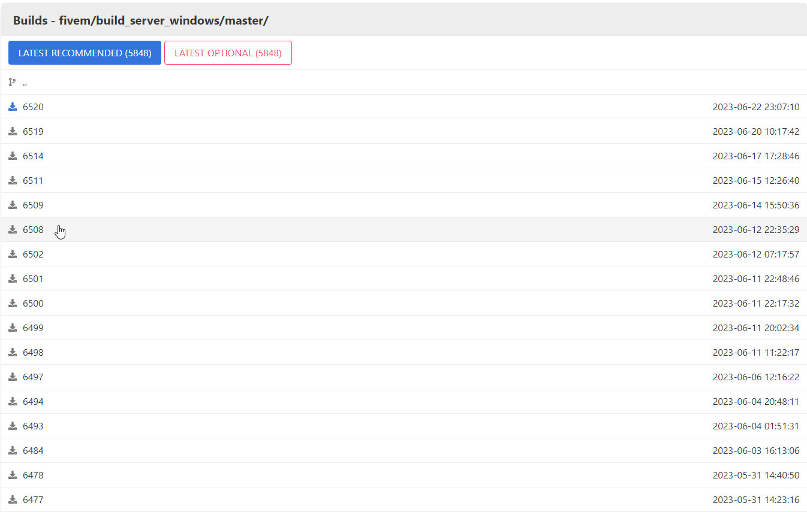
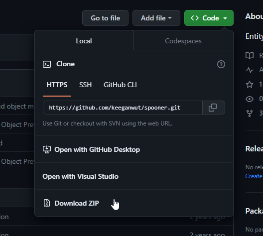

# Intro

This guide will help set you up with a local host server with spooner.

## Getting Started

### What you'll need

- [Keymaster](https://keymaster.fivem.net/):
  - Very important as it is used to assign the server to your account for it to launch.
- [WinRAR](https://www.win-rar.com/fileadmin/winrar-versions/winrar/winrar-x64-622.exe):
  - Used to unzip the server artifacts and spooner zips that you will be downloading.
- [CFX Server Artifacts](https://runtime.fivem.net/artifacts/fivem/build_server_windows/master/) version **6508** or **above**:
  - It is recommended to install version 6508 as this has the latest version of txAdmin and is stable.
- [RedM Spooner](https://github.com/keeganwut/spooner) (Keegan's Rendition)
- [Uiprompt](https://github.com/kibook/redm-uiprompt)

### Getting Key

Head to Keymaster (link provided above) and Sign In.

If you do not have an account it will prompt you to create one.

Once in Keymaster click New Server on the left.

For Display name type anything.

For Initial server IP address get your [IPv4 Address](https://www.whatismyip.com/).

For Server Type select **Other/Home hosted**.

For server provider type in "self hosted".

Complete the Captcha.

Click Generate.

Leave this open for later.

### Downloading WinRAR

Using the resource we provided above download WinRAR and run the **.exe installer**

:::caution BEWARE

WinRAR does prompt you to activate a paid license but this is completely optional as WinRAR is free to use.

:::

### Downloading Artifacts

Navigate on the page until you find the version that we recommended above.

Click on and download the version once you find it.

:::danger WARNING

Do not download the **latest recommended** that is provided via. the blue button as it is severely out-dated.

:::

### Downloading Spooner & Uiprompt

Navigate to the Github repository that was provided earlier.

Once on this page you will see a green download button that reads **Code** with a dropdown arrow.

Click on that then click **Download Zip**.

## Congratulations!

You have successfully downloaded the correct server artifacts and spooner.

To continue further into setting up and running your local host server move onto the [next step](http://localhost:3001/mapping-website/docs/tutorial-basics/directory).
