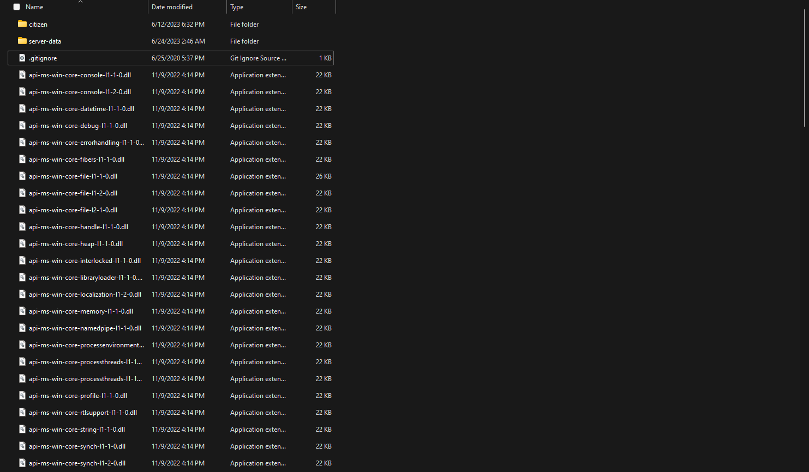
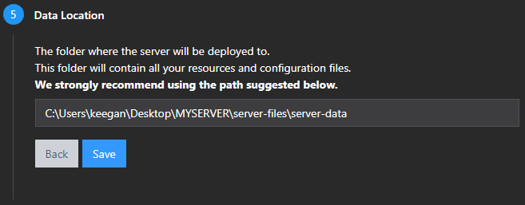

# Running Deployer

This section will explain how to run the txAdmin deployer and get your server prepared to start.

## Unzipping server artifacts

Navigate to your server-files directory it should look like ```Desktop\<NAME_YOU_CHOSE>\server-files```

Open the server artifacts zip we downloaded earlier it should be named **server.7z**

Select all by either going to ```File > Select All``` or using the shortcut **(Ctrl+A)**

Drag the files out of the zip and into your server-files directory.

:::danger BEWARE

Do not hover over the ```server-data``` folder or it will drop in there instead.

:::

Your directory should now look like this.



## Starting txAdmin Deployer

Scroll down in the ```server-files``` directory until you find ```FXServer.exe```

Double click it to run the .exe file.

This will open a command prompt instance and open txAdmin in your browser.

## Configuring txAdmin Deployer

The first page will ask you for the pin given in the command prompt (usually auto-filled) and for you to link your account.

Link your account after putting in the correct 4-Digit pin.

:::caution CAUTION

If you are not logged into a CFX Forums account it will ask you to create or login to an account.

After doing so close out of the command prompt and browser tab and rerun the ```FXServer.exe```.

:::

Click Continue.

Create a backup password, it doesn't need to be a complicated password unless you are port-forwarding the txAdmin Panel.

Click Next.

Pick a name for your local host.

Click on **Popular Recipes** then choose **CFX Default RedM**.

For the Data Location click on the button that reads **Change Path** change this to your ```server-data``` directory.

The above should look something like ```<YOUR_DRIVE>:\Users\<YOUR_USER>\Desktop\<NAME_YOU_CHOSE>\server-files\server-data```



Click Save.

Click **Go to Recipe Deployer**.

Click Next.

Open the Keymaster tab you opened in the beginning and click Copy to copy the key.

Paste the key then click Run Recipe.

Click next after it is done.

Scroll down and click Save & Run Server.
